- The name "Linux" is actually an umbrella term for multiple OS's that are based on UNIX (another operating system)
 
Commands:

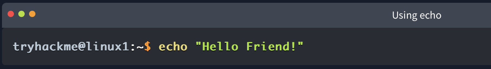
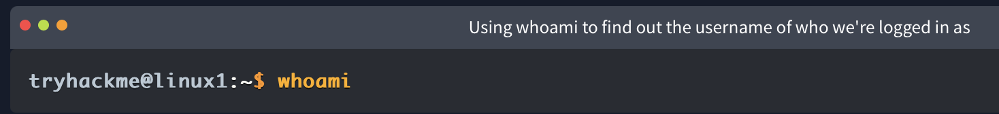
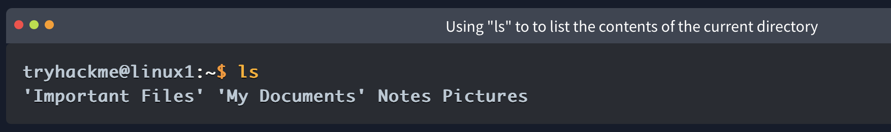
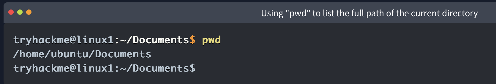
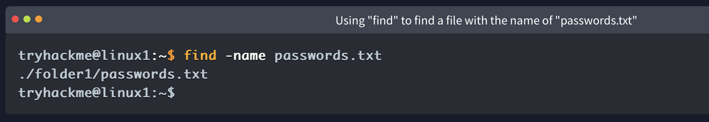
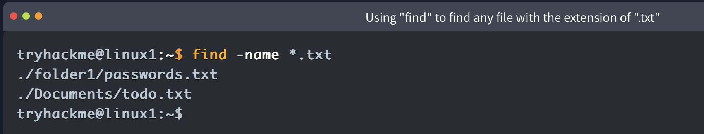
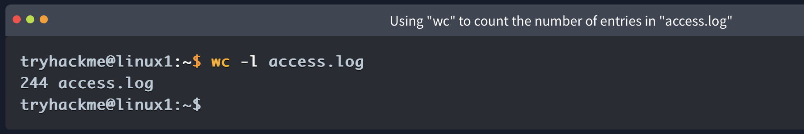
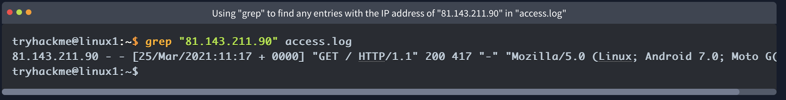

Shell Operators:

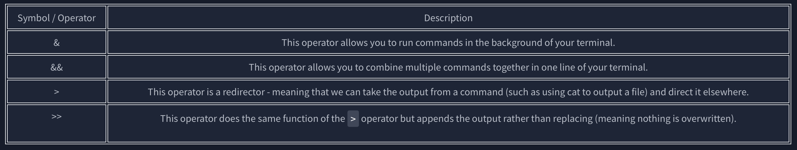

- we can use "&&" to make a list of commands to run for example command1 && command2. However, it's worth noting that command2 will only run if command1 was successful.

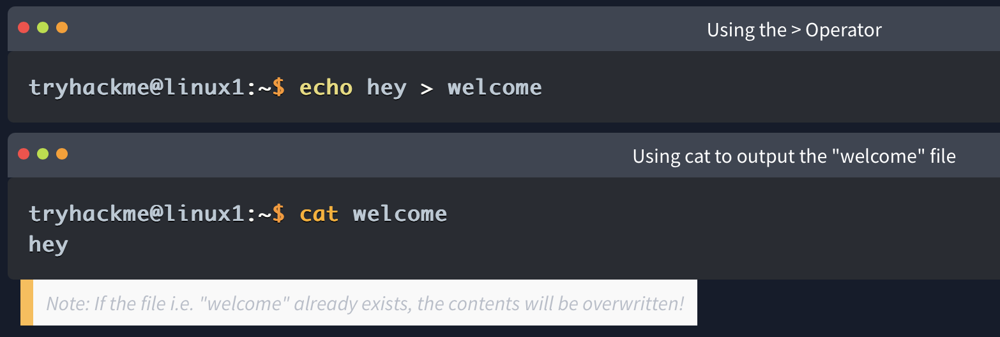
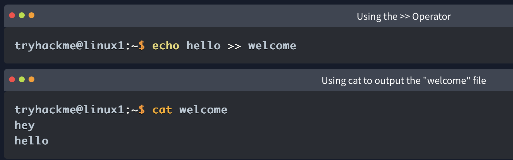
