- The protocol is called Secure Shell or SSH for short and is the common means of connecting to and interacting with the command line of a remote Linux machine.
- SSH allows us to remotely execute commands on another device remotely.
   

Introduction to Flags and Switches:

- A majority of commands allow for arguments to be provided. These arguments are identified by a hyphen and a certain keyword known as flags or switches.
- after using the -a argument (short for --all), we now suddenly have an output with a few more files and folders such as ".hiddenfolder". Files and folders with "." are hidden files.
- 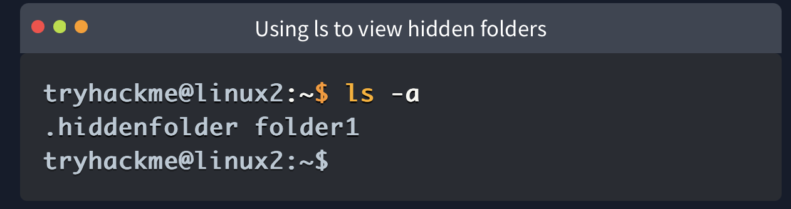
- Commands that accept these will also have a --help option. This option will list the possible options that the command accepts, provide a brief description and example of how to use it.
- 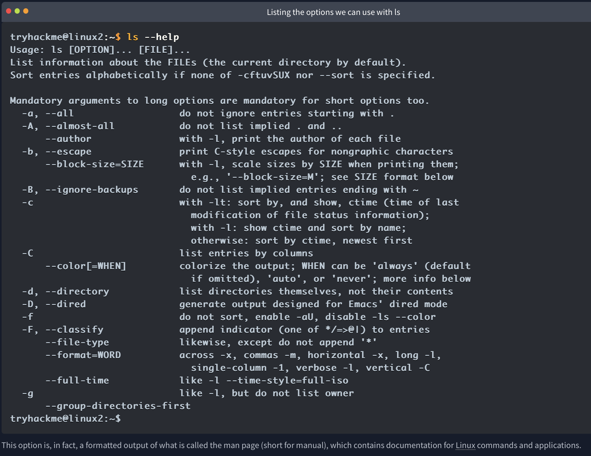 - 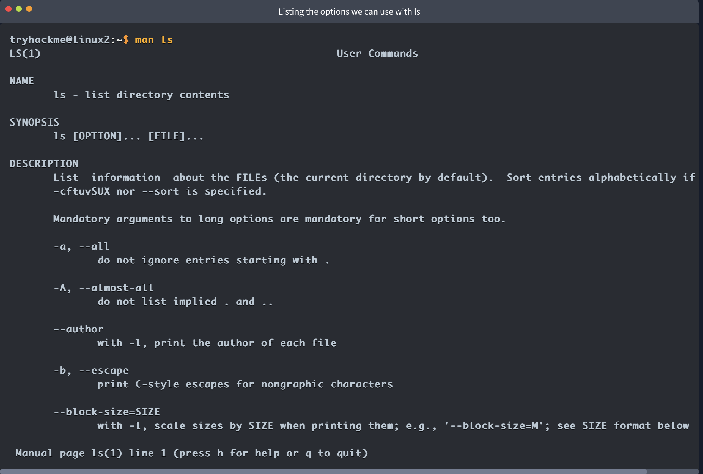
      

Filesystem Interaction Continued:

- 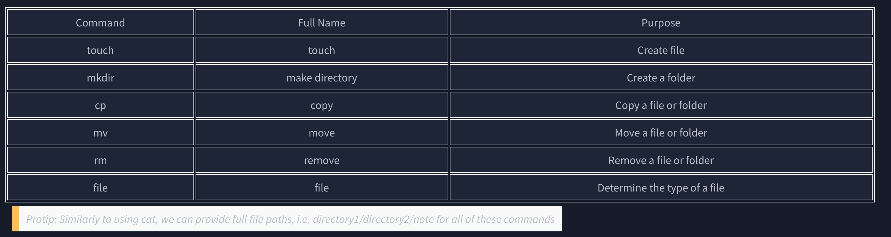
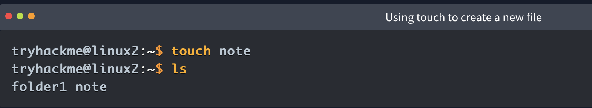
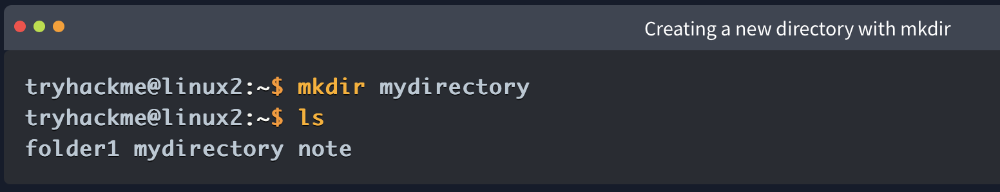
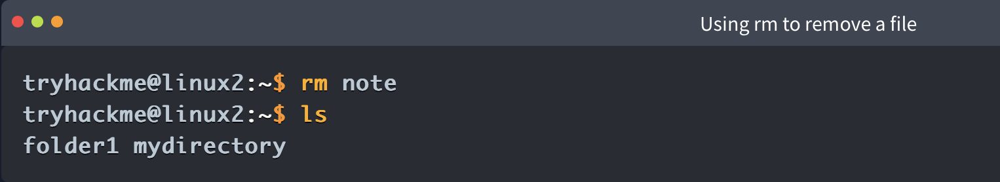
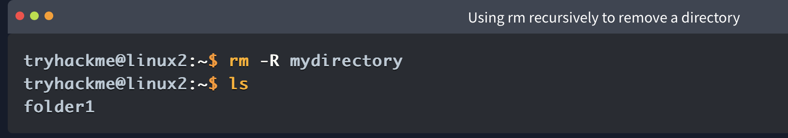
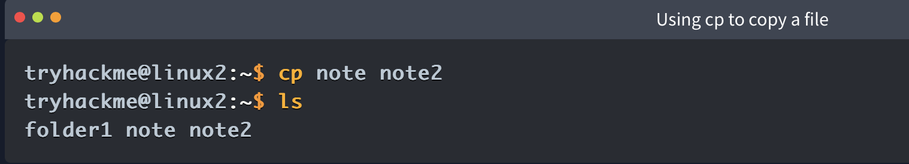
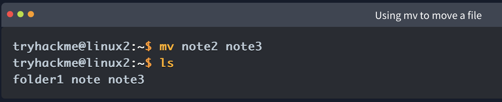
cp copies the entire contents of the existing file into the new file. In the screenshot below, we are copying "note" to "note2".

Moving a file takes two arguments, just like the cp command. However, rather than copying and/or creating a new file, mv will merge or modify the second file that we provide as an argument. Not only can you use mv to move a file to a new folder, but you can also use mv to rename a file or folder. For example, in the screenshot below, we are renaming the file "note2" to be named "note3". "note3" will now have the contents of "note2". 

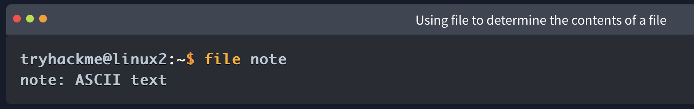

Permissions 101:
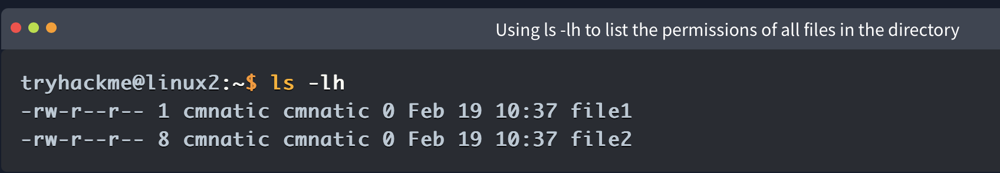

we can see ten columns such as in the screenshot below. However, we're only interested in the first three columns.
   

Briefly: The Differences Between Users & Groups

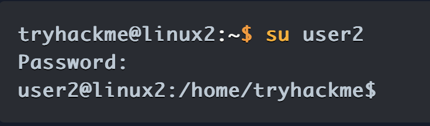

when using su to switch to "user2", our new session drops us into our previous user's home directory. 

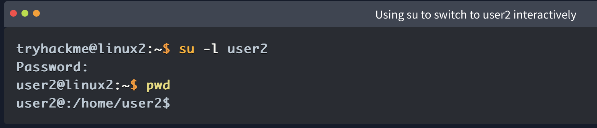

Where now, after using -l or --login switch, our new session has dropped us into the home directory of "user" automatically. 
   

Common Directories:  
/etc

- This root directory is one of the most important root directories on your system.
- The etc folder (short for etcetera) is a commonplace location to store system files that are used by your operating system. 
 
/var

- The "/var" directory, with "var" being short for variable data,  is one of the main root folders found on a Linux install.
- This folder stores data that is frequently accessed or written by services or applications running on the system.
 
/root

- Unlike the /home directory, the /root folder is actually the home for the "root" system user.
- There isn't anything more to this folder other than just understanding that this is the home directory for the "root" user.
- But, it is worth a mention as the logical presumption is that this user would have their data in a directory such as "/home/root" by default.  

/tmp

- This is a unique root directory found on a Linux install. Short for "temporary", the /tmp directory is volatile and is used to store data that is only needed to be accessed once or twice.
- Similar to the memory on your computer, once the computer is restarted, the contents of this folder are cleared out.

What's useful for us in pentesting is that any user can write to this folder by default. Meaning once we have access to a machine, it serves as a good place to store things like our enumeration scripts.