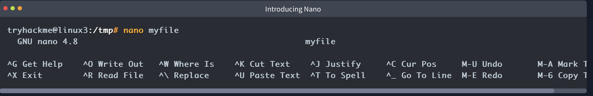
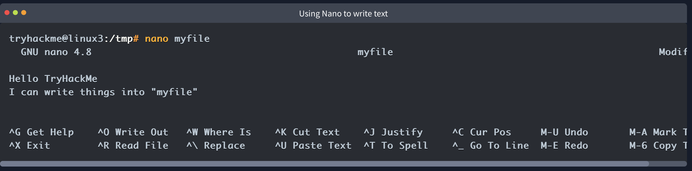
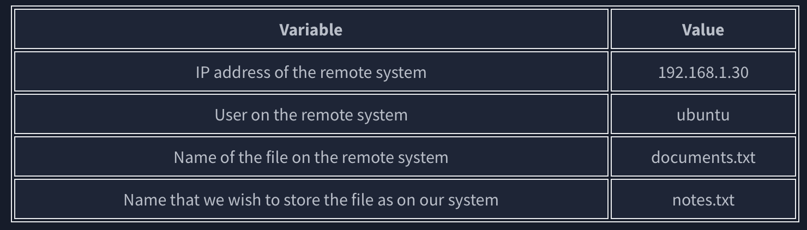
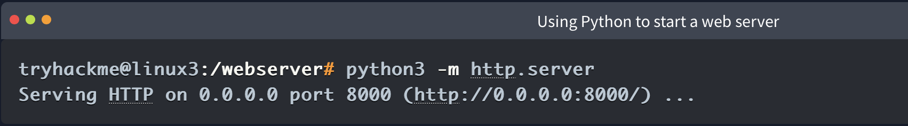
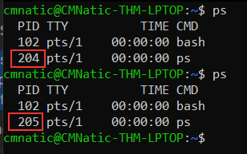
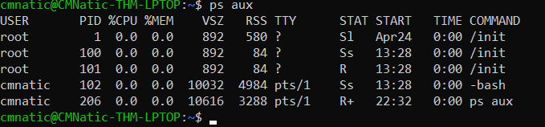
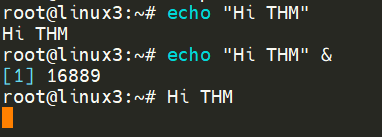
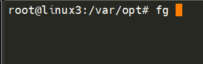

- Throughout the series so far, we have only stored text in files using a combination of the echo command and the pipe operators (\> and \>\>). This isn't an efficient way to handle data when you're working with files with multiple lines and the sorts!

- VIM is a much more advanced text editor. Whilst you're not expected to know all advanced features, it's helpful to mention it for powering up your Linux skills.
   

Downloading Files (Wget):  
wget [https://assets.tryhackme.com/additional/linux-fundamentals/part3/myfile.txt](https://assets.tryhackme.com/additional/linux-fundamentals/part3/myfile.txt)
   

Transferring Files From Your Host - SCP (SSH):

- Secure copy, or SCP, a means of securely copying files. Unlike the regular cp command, this command allows you to transfer files between two computers using the SSH protocol to provide both authentication and encryption.

- With this information, let's craft our scp command (remembering that the format of SCP is just SOURCE and DESTINATION):
- scp important.txt ubuntu@192.168.1.30:/home/ubuntu/transferred.txt
 
And now let's reverse this and layout the syntax for using scp to copy a file from a remote computer that we're not logged into

- The command will now look like the following:
- scp ubuntu@192.168.1.30:/home/ubuntu/documents.txt notes.txt 
   

Serving Files From Your Host - WEB

- Ubuntu machines come pre-packaged with python3.
- Python helpfully provides a lightweight and easy-to-use module called "HTTPServer".
- This module turns your computer into a quick and easy web server that you can use to serve your own files, where they can then be downloaded by another computing using commands such as curl and wget. 
- 

- 
- Note, you will need to open a new terminal to use wget and leave the one that you have started the Python3 web server in. This is because, once you start the Python3 web server, it will run in that terminal until you cancel it.
- One flaw with this module is that you have no way of indexing, so you must know the exact name and location of the file that you wish to use. This is why I prefer to use Updog. [What's Updog](https://github.com/sc0tfree/updog)? A more advanced yet lightweight webserver.
- Use Ctrl + C to stop the Python3 HTTPServer module once you are finished.
    
- Processes 101:Processes are the programs that are running on your machine.
- They are managed by the kernel, where each process will have an ID associated with it, also known as its PID.
- The PIDincrements for the order In which the process starts. I.e. the 60th process will have a PID of 60.
- 
- Note how in the screenshot above, the second process ps has a PID of 204, and then in the command below it, this is then incremented to 205.
- To see the processes run by other users and those that don't run from a session (i.e. system processes), we need to provide aux to the ps command like so: ps aux
- 
- Another very useful command is the top command; top gives you real-time statistics about the processes running on your system instead of a one-time view. These statistics will refresh every 10 seconds
 
- to kill PID 1337, we'd use kill 1337
    - SIGTERM - Kill the process, but allow it to do some cleanup tasks beforehand
    - SIGKILL - Kill the process - doesn't do any cleanup after the fact
    - SIGSTOP - Stop/suspend a process
 
- The process with an ID of 0 is a process that is started when the system boots. This process is the system's init on Ubuntu, such as systemd, which is used to provide a way of managing a user's processes and sits in between the operating system and the user. 
- For example, once a system boots and it initialises, systemd is one of the first processes that are started. Any program or piece of software that we want to start will start as what's known as a child process of systemd.
   

 Getting Processes/Services to Start on Boot:

- systemctl [option] [service]
- For example, to tell apache to start up, we'll use systemctl start apache2
- We can do four options with systemctl:
    - Start
    - Stop
    - Enable
    - Disable
   

An Introduction to Backgrounding and Foregrounding in Linux:

- We can do the exact same when executing things like scripts -- rather than relying on the & operator, we can use Ctrl + Z on our keyboard to background a process.
- t is also an effective way of "pausing" the execution of a script or command
- With our process backgrounded using either Ctrl + Z or the & operator, we can use fg to bring this back to focus like below, where we can see the fg command is being used to bring the background process back into use on the terminal, where the output of the script is now returned to us.

   

Maintaining Your System: Automation:

- Users may want to schedule a certain action or task to take place after the system has booted. Take, for example, running commands, backing up files, or launching your favourite programs on, such as Spotify or Google Chrome.
- the cron p
- rocess, but more specifically, how we can interact with it via the use of crontabs .
- 
-  the online "[Crontab Generator](https://crontab-generator.org/)" that allows you to use a friendly application to generate your formatting for you! As well as the site "[Cron Guru](https://crontab.guru/)"!
    
Maintaining Your System: Package Management:
 
Maintaining Your System: Logs: