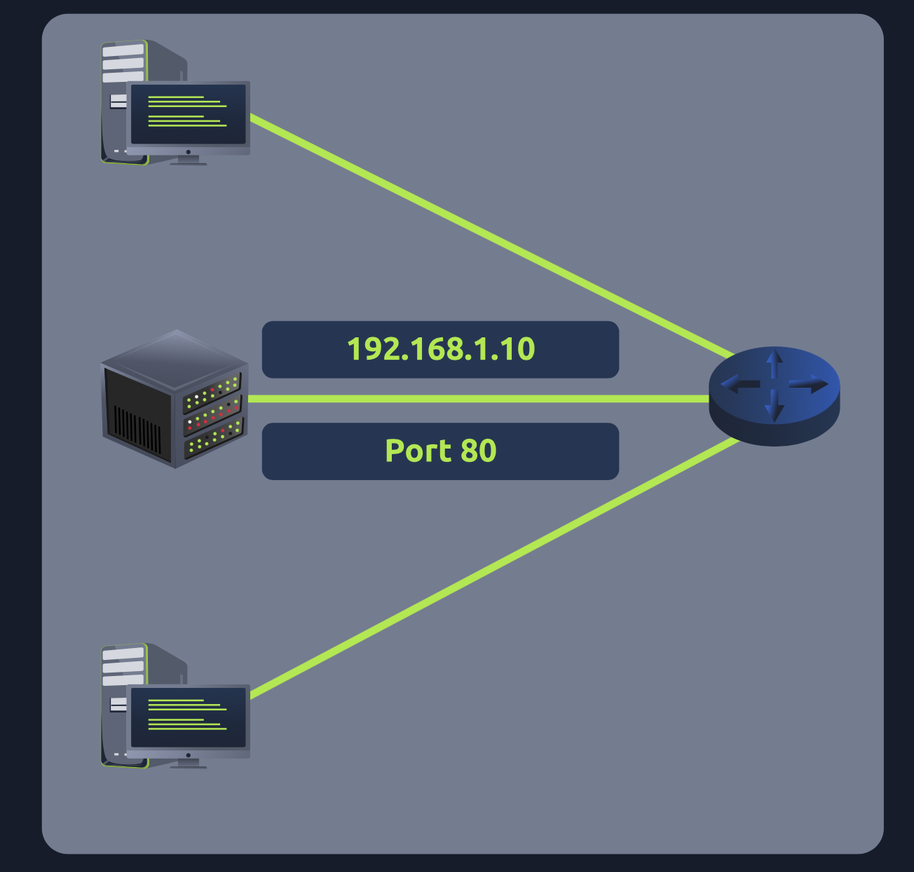
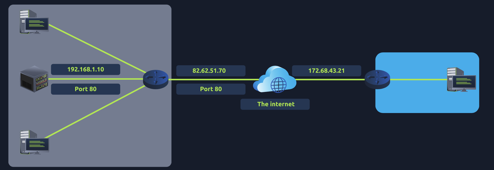
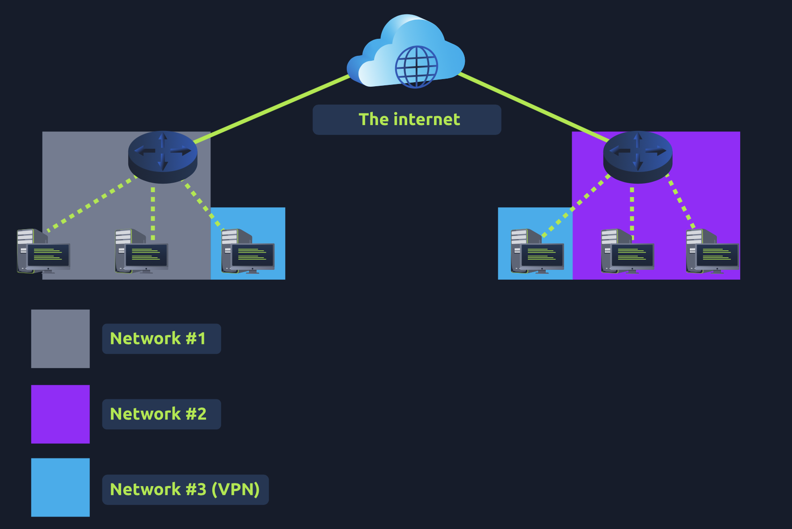

Port Forwarding:

- Without port forwarding, applications and services such as web servers are only available to devices within the same direct network.
- 
-  the server with an IP address of "192.168.1.10" runs a webserver on port 80. Only the two other computers on this network will be able to access it (this is known as an intranet).
- If the administrator wanted the website to be accessible to the public (using the Internet), they would have to implement port forwarding

- Port forwarding is configured at the router of a network.
 
Firewalls: Layer 3, 4
 
VPN:

- VPN allows devices on separate networks to communicate securely by creating a dedicated path between each other over the Internet (known as a tunnel).
- Devices connected within this tunnel form their own private network.
- 
- Network #1 (Office #1)
- Network #2 (Office #2)
- Network #3 (Two devices connected via a VPN)
- The devices connected on Network #3 are still a part of Network #1 and Network #2 but also form together to create a private network (Network #3) that only devices that are connected via this VPN can communicate over.
- Anonymity:
    - Usually, your traffic can be viewed by your ISP and other intermediaries and, therefore, tracked.
    - The level of anonymity a VPN provides is only as much as how other devices on the network respect privacy. For example, a VPNthat logs all of your data/history is essentially the same as not using a VPN in this regard.
- VPN technologies:
    - PPP
    - PPTP
    - IPSec