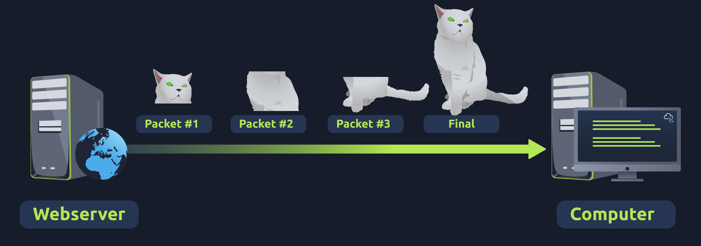
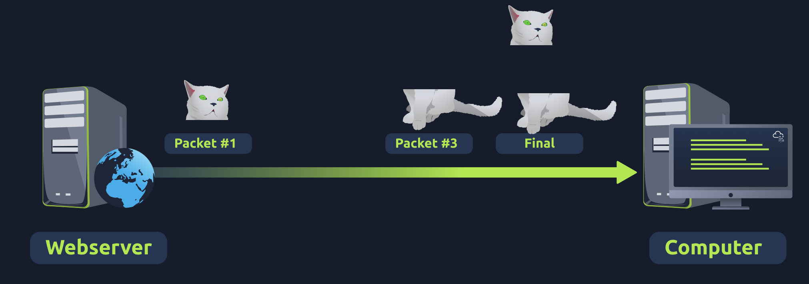
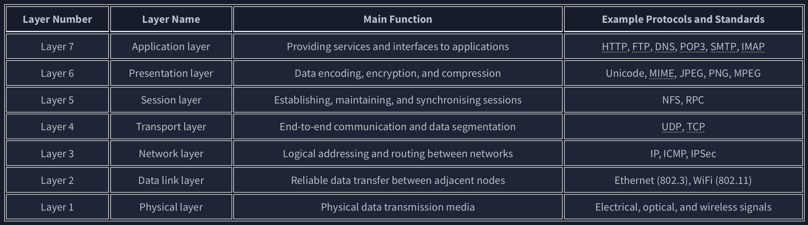

- Physical: this layer references the physical components of the hardware used in networking - DataLink:
    - Frame
    - MAC (Media Access Control) address of the receiving endpoint.
    - Inside every network-enabled computer is a Network Interface Card (NIC) which comes with a unique MAC address to identify it.
    - The three leftmost bytes identify the vendor
    - Examples of layer 2 include Ethernet, i.e., 802.3, and WiFi, i.e., 802.11. Ethernet and WiFi addresses are six bytes - Network:
    - IP Addressees, Router
    - where the magic of routing & re-assembly of data takes place (from these small chunks to the larger chunk)
    - protocols determine exactly what is the "optimal" path
    - These protocols include **OSPF** (**O**pen **S**hortest **P**ath **F**irst) and **RIP** (**R**outing **I**nformation **P**rotocol)
    - network layer include Internet Protocol (IP), Internet Control Message Protocol (ICMP), and Virtual Private Network (VPN) protocols such as IPSec and SSL/TLS VPN. - Transport:
    - enables end-to-end communication between running applications on different hosts.
    - Your web browser is connected to the TryHackMe web server over the transport layer, which can support various functions like flow control, segmentation, and error correction.
    - Examples of layer 4 are Transmission Control Protocol (TCP) and User Datagram Protocol (UDP).
    
    - TCP 
      

    - UDP 
    - 
    
    - only Packets #1 and #3 have been received by the "Computer", meaning that half of the image is missing. - Session:
    - Once data has been correctly translated or formatted from the presentation layer (layer 6), the session layer (layer 5) will begin to create and maintain the connection
    - a session _can_ contain "checkpoints," where if the data is lost, only the newest pieces of data are required to be sent, saving bandwidth.
    - Data synchronisation ensures that data is transmitted in the correct order and provides mechanisms for recovery in case of transmission failures.
    - Examples of the session layer are Network File System (NFS) and Remote Procedure Call (RPC). - Presentation:
    - Layer 6 handles data encoding, compression, and encryption. An example of encoding is character encoding, such as ASCII or Unicode.
    - Security features such as data encryption (like HTTPS)
    - Because software developers can develop any software such as an email client differently, the data still needs to be handled in the same way — no matter how the software works.
    - This layer acts as a translator for data to and from the application layer (layer 7).
    - Consider the scenario where we want to send an image via email. First, we use JPEG, GIF, and PNG to save our images; furthermore, although hidden from the user by the email client, we use MIME (Multipurpose Internet Mail Extensions) to attach the file to our email. MIME encodes a binary file using 7-bit ASCII characters. - Application:
    - Most familiar by users perspective.
    - Everyday applications such as email clients, browsers, or file server browsing software such as FileZilla provide a friendly, **G**raphical **U**ser **I**nterface (**GUI**) for users to interact with data sent or received.
    - Other protocols include **DNS** (**D**omain **N**ame **S**ystem), which is how website addresses are translated into IP addresses.
    - Examples of Layer 7 protocols are HTTP, FTP, DNS, POP3, SMTP, and IMAP. Don’t worry if you are not familiar with all of them.
            

Summary

- Remembering the OSI model layers with their layer numbers is important; otherwise, you will struggle to understand terms such as “layer 3 switch” or “layer 7 firewall.”