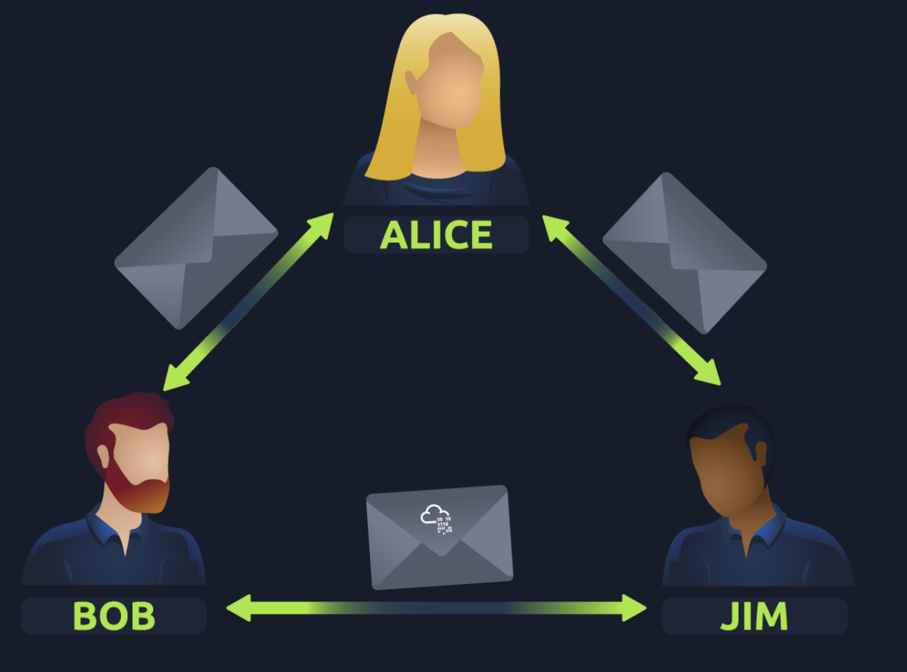
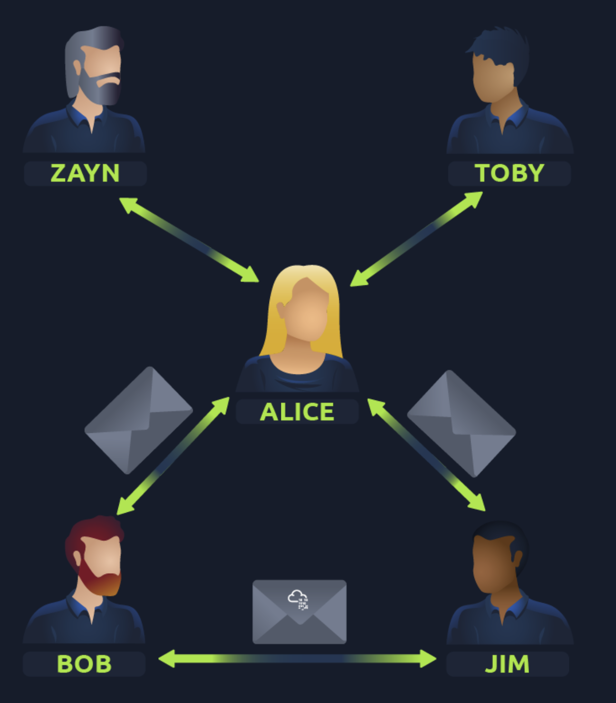
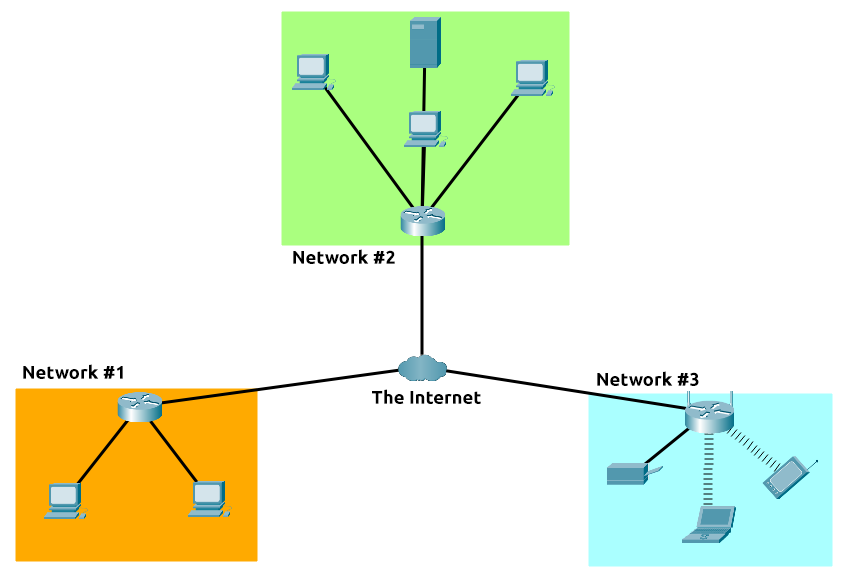
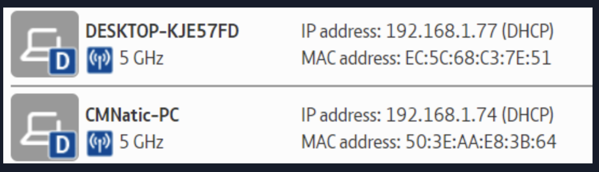
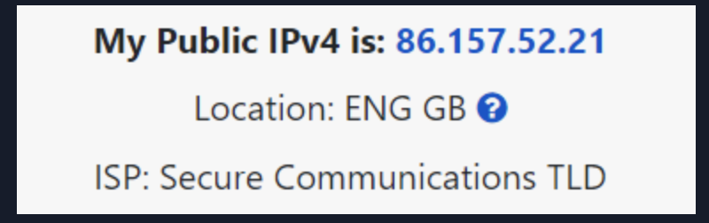
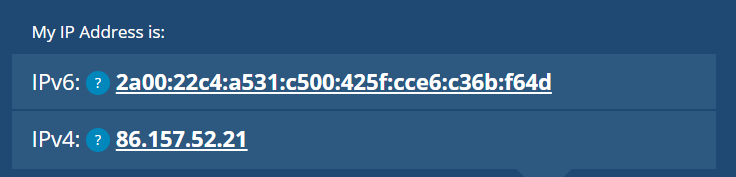
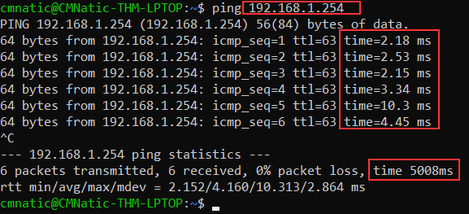

- Networks are simply things connected. For example, your friendship circle: you are all connected because of similar interests, hobbies, skills and sorts.
Networks can be found in all walks of life:
    - A city's public transportation system
    - Infrastructure such as the national power grid for electricity
    - Meeting and greeting your neighbours
    - Postal systems for sending letters and parcels
- 

**What is the Internet?**

- The first iteration of the Internet was within the ARPANET project in the late 1960s.
- This project was funded by the United States Defence Department and was the first documented network in action.
- However, it wasn't until 1989 when the Internet as we know it was invented by Tim Berners-Lee by the creation of the **W**orld **W**ide **W**eb (**WWW**).
- It wasn't until this point that the Internet started to be used as a repository for storing and sharing information, just like it is today.
- The Internet is one giant network that consists of many, many small networks within itself.
- Using our example from the previous task, let's now imagine that Alice made some new friends named Zayn and Toby that she wants to introduce to Bob and Jim. The problem is that Alice is the only person who speaks the same language as Zayn and Toby. So Alice will have to be the messenger!
- 
- 
- As previously stated, the Internet is made up of many small networks all joined together.  These small networks are called private networks, where networks connecting these small networks are called public networks or the Internet! 
- So, to recap, a network can be one of two types:
    - A private network
    - A public network      

**Identifying Devices on a Network**

- Devices on a network are very similar to humans in the fact that we have two ways of being identified:
    - Our Name
    - Our Fingerprints
- Every human has an individual set of fingerprints which means that even if they change their name, there is still an identity behind it. Devices have the same thing: two means of identification, with one being permeable. These are:
    - An IP Address
    - A Media Access Control (MAC) Address -- think of this as being similar to a serial number.   

IP Addresses:

- Briefly, an IP address (or Internet Protocol) address can be used as a way of identifying a host on a network for a period of time, where that IP address can then be associated with another device without the IP address changing.
- An IP address is a set of numbers that are divided into four octets. The value of each octet will summarise to be the IP address of the device on the network.
- This number is calculated through a technique known as IP addressing & subnetting.
- IP addresses can change from device to device but cannot be active simultaneously more than once within the same network.
- IP Addresses follow a set of standards known as protocols. These protocols are the backbone of networking and force many devices to communicate in the same language.
- A public address is used to identify the device on the Internet, whereas a private address is used to identify a device amongst other devices.
- 
- 
- These two devices will be able to use their private IP addresses to communicate with each other.
- However, any data sent to the Internet from either of these devices will be identified by the same public IP address.
- Public IP addresses are given by your **I**nternet **S**ervice **P**rovider (or **ISP**) at a monthly fee (your bill!)
- 

IPv6:

- As more and more devices become connected, it is becoming increasingly harder to get a public address that isn't already in use.
- For example, Cisco, an industry giant in the world of networking, estimated that there would be approximately 50 billion devices connected on the Internet by the end of 2021. [(Cisco., 2021)](https://www.cisco.com/c/dam/en_us/about/ac79/docs/innov/IoT_IBSG_0411FINAL.pdf).
- So far, we have only discussed one version of the Internet Protocol addressing scheme known as IPv4, which uses a numbering system of 2^32 IP addresses (4.29 billion) -- so you can see why there is such a shortage!
IPv6 is a new iteration of the Internet Protocol addressing scheme to help tackle this issue.
    - Supports up to 2^128 of IP addresses (340 trillion-plus), resolving the issues faced with IPv4
    - More efficient due to new methodologies
 

MAC Addresses:

- Devices on a network will all have a physical network interface, which is a microchip board found on the device's motherboard. This network interface is assigned a unique address at the factory it was built at, called a **MAC** (**M**edia **A**ccess **C**ontrol ) address.
- The MAC address is a **twelve-character** hexadecimal number. The first six characters represent the company that made the network interface, and the last six is a unique number.
- However, an interesting thing with MAC addresses is that they can be faked or "spoofed" in a process known as spoofing.
- This spoofing occurs when a networked device pretends to identify as another using its MAC address.
- When this occurs, it can often break poorly implemented security designs that assume that devices talking on a network are trustworthy.
- Take the following scenario: A firewall is configured to allow any communication going to and from the MAC address of the administrator. If a device were to pretend or "spoof" this MAC address, the firewall would now think that it is receiving communication from the administrator when it isn't.      

**Ping (ICMP)**

- Ping is one of the most fundamental network tools available to us.
- Ping uses **ICMP** (**I**nternet **C**ontrol **M**essage **P**rotocol) packets to determine the performance of a connection between devices, for example, if the connection exists or is reliable.
- 
- Here we are pinging a device that has the private address of _192.168.1.254_. Ping informs us that we have sent six ICMP packets, all of which were received with an average time of 4.16 milliseconds.         
               

