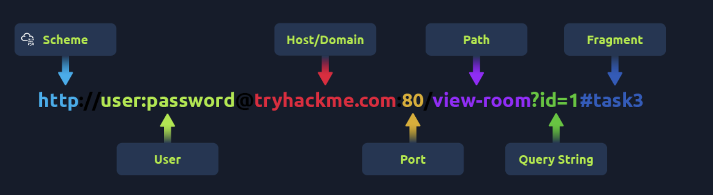
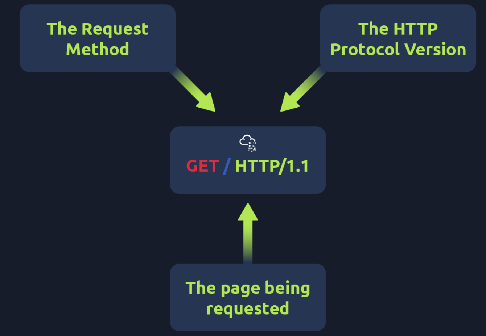
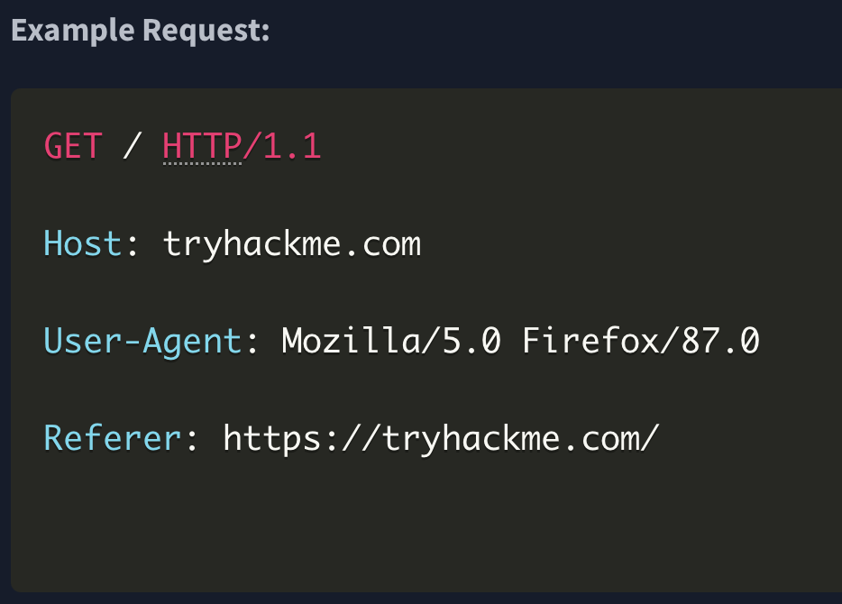
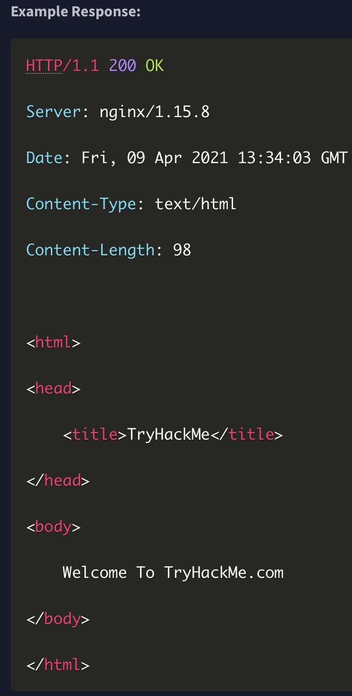
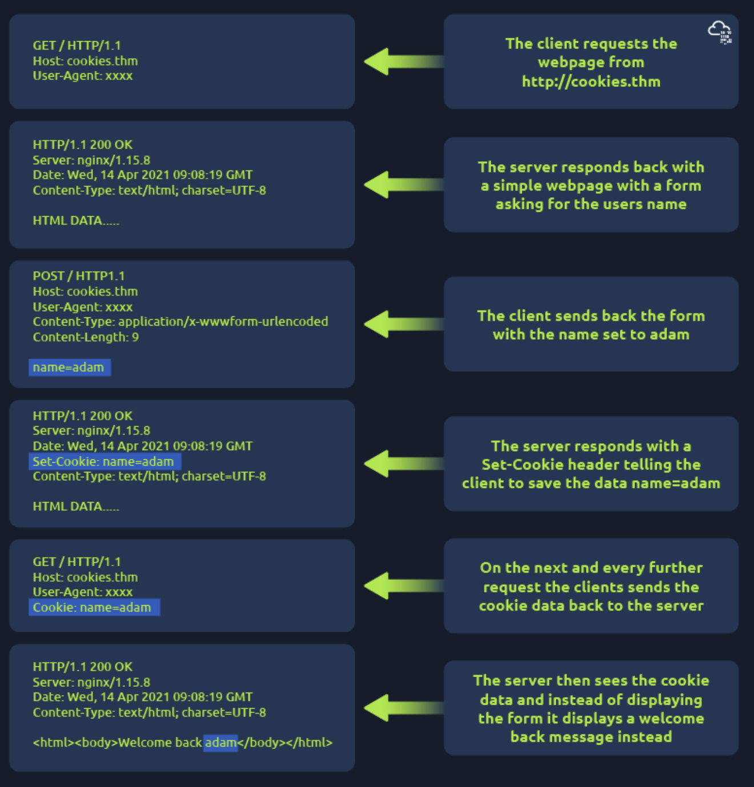

- URL
- 
 
- It's possible to make a request to a web server with just one line "**GET /** **HTTP****/1.1**"
-  - 
- HTTP requests always end with a blank line to inform the web server that the request has finished. - 
-  HTTP response contains a blank line to confirm the end of the HTTP response.
      

Http methods:

- **GET** **Request:** This is used for getting information from a web server.
- **POST** **Reques:** This is used for submitting data to the web server and potentially creating new records
- **PUT** **Request:** This is used for submitting data to a web server to update information
- **DELETE** **Request:** This is used for deleting information/records from a web server.
 
Cookies:

-  they're just a small piece of data that is stored on your computer.
- Cookies are saved when you receive a "Set-Cookie" header from a web server. Then every further request you make, you'll send the cookie data back to the web server.
- Because HTTP is stateless (doesn't keep track of your previous requests), cookies can be used to remind the web server who you are, some personal settings for the website or whether you've been to the website before
- 
- Cookies can be used for many purposes but are most commonly used for website authentication.
- The cookie value won't usually be a clear-text string where you can see the password, but a token (unique secret code that isn't easily humanly guessable).